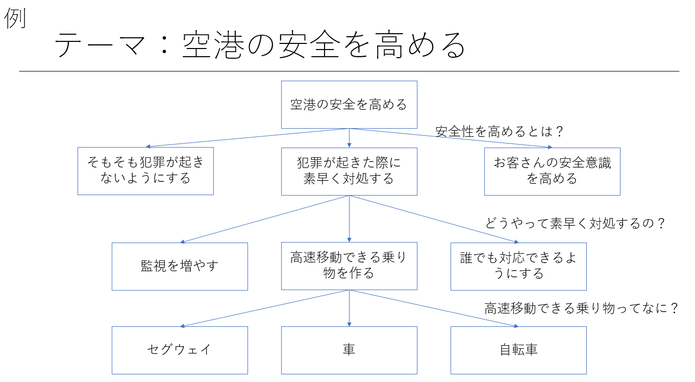
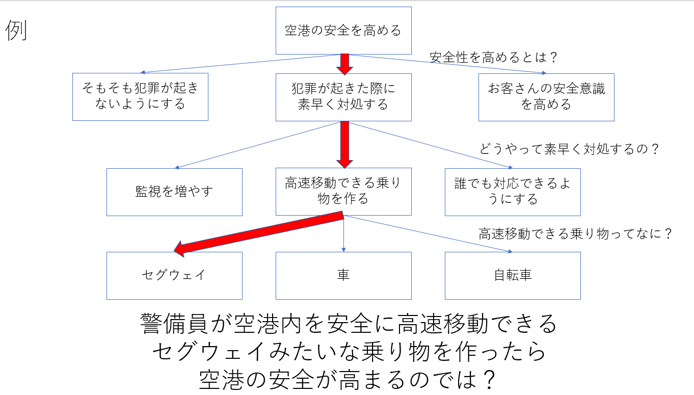

# Post it でできるデザイン思考

## そもそもデザイン思考とは
文字通り**デザイン**を**思考**すること

- ざっくり書くと、「物やサービスの在り方や形を考えること」
- 何が必要で何が必要でないのかが見えてくる
- ビジネスモデルを考えるものではない
- KJ法やブレストとは違う

## デザイン思考でわかること
**問題解決**の**形**・**方法**がわかる

## デザイン思考のやり方
デザイン思考をするのに必要なもの
- 大きめのポストイット(付箋)
- ポストイットを貼ってもいい壁　ホワイトボード(大) 書き込んでいいやつ
- ペン
- 出来れば考え方の違う人　数名
- 少なくとも2人以上でやることをおすすめ

### 例
デザイン思考の例

このデザイン思考はツリー状で行う。

例では「空港の安全を高めるには」という題材でスタートしている。

空港の安全を高めるには？という問題に対してのアプローチは沢山ある。じゃあそれを実現するには？じゃあそれを何で実現するの？…

となぜ？どうして？どうやって？どのように？なんで？と疑問を何度も何度も繰り返し、問題解決をする。それがデザイン思考。

## 注意点
- ここで書いたのはあくまで一例
- これで出てきたものが正解なのではなく、あくまでこれは仮説。次は検証をしよう
- 深掘りしすぎない　本来の目的を見失ってしまう
